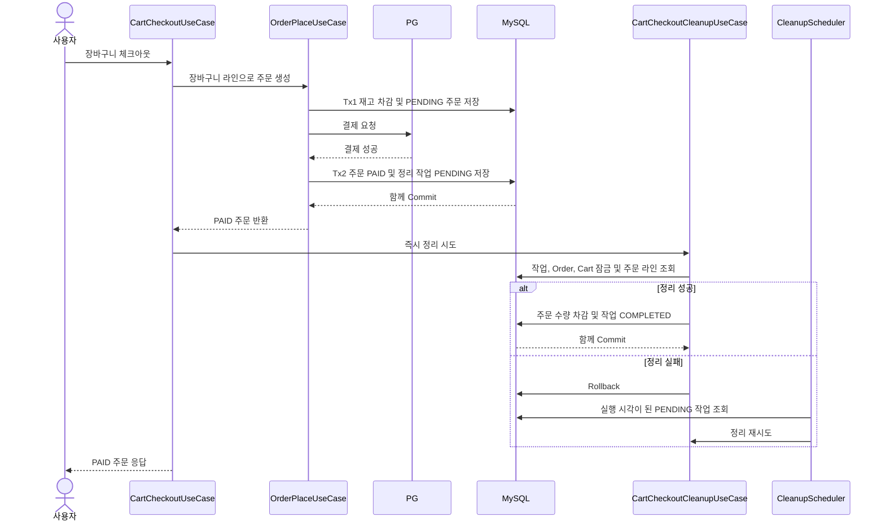

# 카트 체크아웃 설계 결정

작성: 2026-07-04 · 수정: 2026-07-17 · 상태: 구현 완료

## 1. 배경

초기 구현에서 장바구니와 주문은 백엔드에서 직접 결합하지 않았다.

클라이언트가 장바구니를 조회한 뒤 기존 주문 생성 API에 주문 라인을 전달하고, 주문 성공 후 카트 비우기 API를 별도로 호출하는 구조였다.

```text
GET /api/v1/carts
POST /api/v1/orders
DELETE /api/v1/carts
```

이 구조는 단순하고 주문 도메인이 카트를 몰라도 된다는 장점이 있다.
하지만 다음 요구가 생기면 한계가 명확해진다.

- 주문 완료 후 카트 정리를 서버가 보장해야 한다.
- 어떤 주문이 어떤 카트에서 전환되었는지 추적해야 한다.
- 주문 성공 후 카트 비우기 호출 실패, 앱 종료, 네트워크 실패 같은 클라이언트 오케스트레이션 실패를 줄여야 한다.
- 장바구니 일부 라인만 주문하는 부분 체크아웃 정책을 서버에서 일관되게 다뤄야 한다.

## 2. 결정

카트 정리 보장과 주문 출처 추적을 위해, 기존 `POST /api/v1/orders`에 `cartId`만 추가하기보다 **서버 주도 카트 체크아웃 API**를 도입한다.

권장 API 형태는 다음과 같다.

```text
POST /api/v1/carts/checkout
```

체크아웃 UseCase는 application 계층의 오케스트레이션으로 둔다.

```text
CartCheckoutUseCase
  -> memberId 기준 Cart 조회
  -> CartLine을 주문 입력으로 변환
  -> OrderPlaceUseCase가 sourceCartId를 포함해 주문 생성·최종 검증·재고 차감
  -> 결제 성공 시 정리 작업 저장 후 주문 수량만 카트에서 차감
```

주문 도메인 모델이 카트 도메인 객체를 직접 알 필요는 없다.
다만 application 계층에서 카트 기반 주문 생성 흐름을 명시적으로 조율한다.

## 3. 추천 이유

서버 체크아웃 API를 추천하는 이유는 다음과 같다.

- **정리 보장**: 주문 결제 성공 후 카트를 비울지, 주문한 라인만 제거할지, 결제 실패 시 유지할지를 서버가 일관되게 결정할 수 있다.
- **추적성**: 주문에 `sourceCartId`를 남기거나 별도 매핑을 저장하면 주문이 어떤 카트에서 전환되었는지 확인할 수 있다.
- **검증 책임 명확화**: 클라이언트가 임의로 `cartId`를 주문 요청에 붙이는 방식보다, 서버가 회원의 카트를 직접 조회하고 소유권을 검증하는 쪽이 안전하다.
- **부분 체크아웃 확장성**: `selectedSkuIds` 또는 `selectedLineIds`를 받아 성공한 라인만 제거하는 정책으로 확장하기 쉽다.

## 4. 대안과 기각 이유

### 기존 주문 생성 API에 `cartId` 추가

`POST /api/v1/orders` 요청에 `cartId` 또는 `source=CART`를 추가하는 방식이다.

이 방식은 구현량이 적지만 추천하지 않는다.

- 주문 API가 일반 주문 생성과 카트 기반 주문 생성을 함께 떠안는다.
- 클라이언트가 넘긴 출처 정보를 서버가 그대로 믿을 수 없다.
- 신뢰하지 않으려면 결국 서버가 카트를 다시 조회하고 소유권을 검증해야 한다.
- 주문 성공 후 카트 정리 정책까지 넣으면 사실상 체크아웃 API와 같은 책임을 갖게 된다.

### 현행 클라이언트 오케스트레이션 유지

현행 방식은 단순하지만, 서버가 주문과 카트의 연결을 알 수 없다.

- 주문이 어떤 카트에서 왔는지 추적할 수 없다.
- 주문 성공 후 카트 정리 실패를 서버가 보상할 수 없다.
- 감사, CS, 운영 관점에서 카트-주문 전환 이력을 설명하기 어렵다.

따라서 카트 정리와 출처 추적이 중요해지는 시점에는 현행 방식을 유지하지 않는다.

## 5. 구현 시 고려사항

### 카트 정리 시점

카트는 결제 성공으로 주문이 `PAID`가 된 뒤 정리한다.

결제 실패 또는 주문 생성 실패 시에는 카트를 유지한다.
고객이 같은 장바구니로 다시 시도할 수 있어야 하기 때문이다.

### 전체 체크아웃도 주문 수량만 차감

전체 체크아웃이어도 결제 중 사용자가 다른 상품을 담거나 같은 SKU 수량을 늘릴 수 있다.
따라서 결제 성공 후 현재 카트를 통째로 비우지 않고 주문 라인의 `(skuId, quantity)`만 차감한다.

- 현재 수량이 주문 수량보다 크면 차이만 유지한다.
- 현재 수량이 주문 수량 이하면 라인을 제거한다.
- 주문하지 않은 SKU와 이미 없는 SKU는 그대로 둔다.

현재 CartLine의 안정적인 식별자는 `skuId`뿐이다. 결제 중 라인을 삭제한 뒤 같은 SKU를 다시 담은 경우처럼 과거 수량과 새 수량을 구분해야 한다면 별도의 체크아웃 예약 모델이 필요하며 현재 범위에서는 보류한다.

### 출처 저장

최소 저장안은 주문에 `sourceCartId`를 남기는 것이다.

부분 체크아웃이나 상세 추적이 필요하면 주문 라인과 카트 라인 출처를 연결하는 별도 매핑을 검토한다.
다만 현재 `CartLine`은 저장 시 전량 교체 전략 때문에 DB id가 안정적인 비즈니스 식별자가 아니다.
라인 단위 추적이 필요하다면 `cartLineId`보다 `sourceCartId + skuId + quantity` 또는 별도 체크아웃 스냅샷을 우선 검토한다.

### 트랜잭션 경계

현재 주문 생성은 `OrderPlaceUseCase`가 `TransactionTemplate`으로 재고 차감과 주문 대기 저장, 외부 결제 호출, 결제 결과 반영을 분리한 2단계 흐름이다.

카트 정리는 결제 성공 반영 이후 별도 트랜잭션에서 수행한다. 외부 결제를 DB 트랜잭션으로 되돌릴 수 없으므로 체크아웃 전체를 하나의 `@Transactional`로 묶지 않는다.

주문을 `PAID`로 반영하는 Tx2에서 `cart_cleanup_tasks`의 `PENDING` 작업을 함께 저장한다. 정리 트랜잭션은 작업 행과 Cart 루트를 잠그고 주문 수량 차감과 작업 `COMPLETED` 변경을 함께 커밋한다. 실패하면 둘 다 롤백되어 같은 작업을 다시 실행할 수 있다.

`CartCleanupTask`는 별도 비즈니스 Aggregate가 아니라 트랜잭션 사이 진행 상태와 처리 영수증을 남기는 기술적 process record다. 따라서 Tx2가 수정하는 비즈니스 Aggregate는 Order 하나이고, 정리 트랜잭션이 수정하는 비즈니스 Aggregate는 Cart 하나다. 각 트랜잭션에 작업 레코드를 원자적으로 덧붙이는 이유는 `PAID`와 작업 생성 사이, Cart 차감과 작업 완료 사이의 유실 구간을 없애기 위해서다.

## 6. 현재 상태

현재 구현은 서버 체크아웃 API를 제공한다.

```text
POST /api/v1/carts/checkout
```

요청 body는 현재 전체 체크아웃 기준이며, 회원 식별자는 인증 주체에서 가져온다.

```text
lockMode
couponId(optional)
```

처리 흐름은 application 계층의 `CartCheckoutUseCase`가 담당한다.

- `memberId` 기준으로 Cart를 조회한다.
- 카트가 없으면 `NOT_FOUND`, 비어 있으면 `BAD_REQUEST`로 거부한다.
- CartLine을 기존 주문 생성 입력으로 변환하고 `sourceCartId`를 포함해 주문을 생성한다.
- 주문이 결제 성공으로 `PAID`가 되면 정리 작업을 저장하고 주문 수량만 카트에서 차감한다.
- 결제 실패로 주문이 `CANCELLED`가 되거나 주문 생성이 실패하면 카트는 유지한다.
- 즉시 정리가 실패해도 `PAID` 응답을 유지하고 스케줄러가 `PENDING` 작업을 재시도한다.
- 정리 실패 뒤 주문이 사용자 취소되면 카트를 유지한 채 작업을 완료한다.
- 이전 정리 작업이 계속 실패하면 같은 회원의 새 체크아웃을 `CONFLICT`로 막는다.

카트 기반 주문은 `orders.source_cart_id`로 어떤 카트에서 전환되었는지 추적한다.

### 결제 완료 후 카트 정리 흐름



`cart_cleanup_tasks.order_id`는 유니크하며 같은 주문의 중복 차감을 막는 처리 영수증 역할을 한다. 실패 횟수, 다음 실행 시각, 마지막 오류를 저장하고 완료 행은 즉시 삭제하지 않는다.

테이블 DDL은 `docker/mysql/init/02-create-cart-cleanup-tasks.sql`에 둔다. Docker init 스크립트는 새 MySQL 볼륨에서만 자동 실행되므로 기존 로컬·운영 DB에는 같은 DDL을 배포 절차로 별도 적용해야 한다.

기존 로컬 볼륨에는 다음처럼 한 번 적용한다.

```bash
docker compose -f docker/infra-compose.yml exec -T mysql \
  mysql -uapplication -papplication commerce \
  < docker/mysql/init/02-create-cart-cleanup-tasks.sql
```

dev·qa·prod에서는 비밀번호를 명령행에 넣지 말고 각 환경의 스키마 배포 절차로 같은 DDL을 먼저 적용한 뒤 애플리케이션을 배포한다.

카트 변경 유스케이스와 정리 작업은 모두 Cart 루트와 CartLine의 비관적 쓰기 잠금을 사용한다. MySQL `REPEATABLE READ`에서 루트만 잠근 뒤 라인을 일반 조회하면 앞서 만들어진 스냅샷을 볼 수 있으므로, 라인도 `FOR UPDATE` 현재 읽기로 가져온다. 라인 전량 교체는 오래된 행 ID를 다시 조회하지 않는 bulk DELETE 후 재삽입으로 처리한다. 정리와 주문 취소도 같은 Order 루트 쓰기 잠금을 사용하므로, 취소가 먼저 커밋되면 정리는 카트를 유지하고 작업만 완료한다.

체크아웃 요청 자체의 중복 실행과 결제 미확정 상태 복구는 별도 멱등 키가 필요한 후속 과제로 남긴다.
