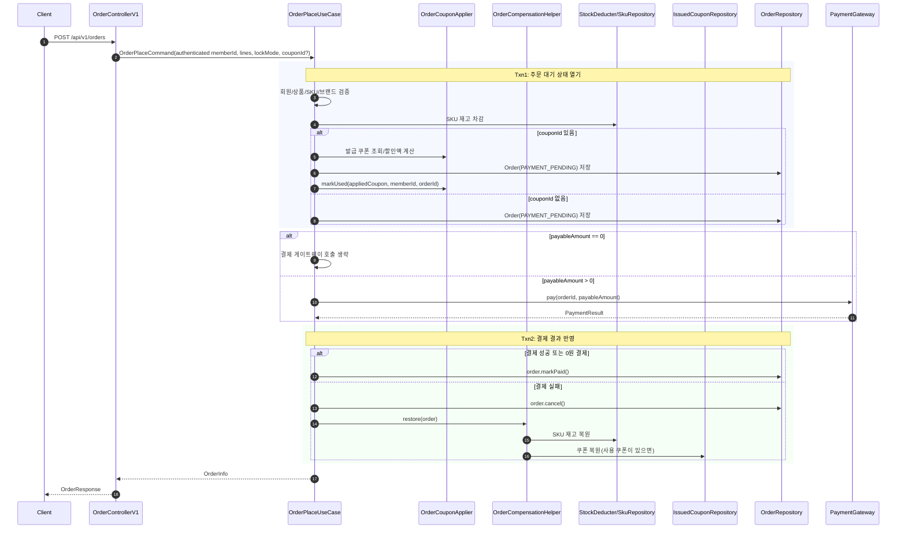
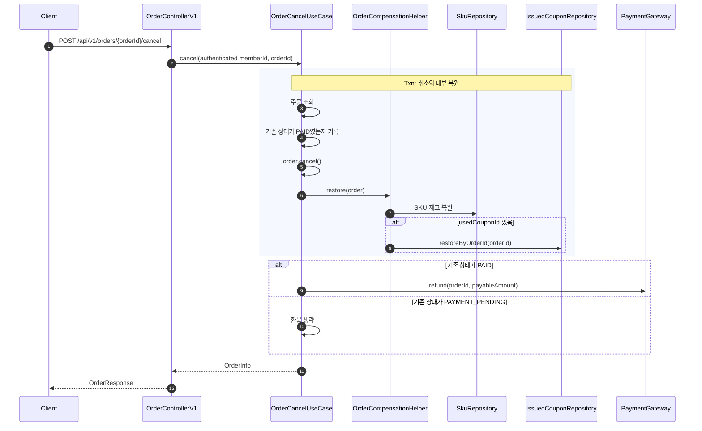

# 주문-결제-쿠폰 통합 흐름

작성: 2026-06-14 · 상태: 구현 기준 정리

이 문서는 주문 생성 요청이 들어온 뒤 재고, 쿠폰, 결제가 어떤 순서로 처리되고 실패 시 무엇을 되돌리는지 한 번에 읽기 위한 흐름 문서다.
세부 정책은 [주문 정책](./01-order-policy.md), [주문 도메인 스펙](./order-domain-spec.md), [쿠폰 정책](../coupon/01-coupon-policy.md), [쿠폰 도메인 스펙](../coupon/coupon-domain-spec.md)을 따른다.

## 1. 전체 그림

주문 생성은 하나의 긴 트랜잭션으로 처리하지 않는다.
재고 차감과 주문 생성은 짧은 트랜잭션에서 확정하고, 외부 결제 호출은 트랜잭션 밖에서 수행한 뒤, 결제 결과를 두 번째 트랜잭션에서 반영한다.



핵심 원칙은 다음 네 가지다.

- 결제 호출은 외부 시스템 호출이므로 재고 차감 트랜잭션 밖에서 수행한다.
- 주문은 결제 성공 전에도 `PAYMENT_PENDING` 상태로 먼저 저장한다.
- 쿠폰은 결제 성공 후가 아니라 `Txn1`에서 먼저 사용 처리한다. 결제 대기 중 같은 쿠폰이 다른 주문에 중복 사용되는 것을 막기 위해서다.
- 결제 실패 또는 주문 취소가 발생하면 재고와 쿠폰을 함께 복원한다.

## 2. 입력과 응답

주문 생성 API는 `POST /api/v1/orders`다.
카트 기반 주문은 `POST /api/v1/carts/checkout`이 서버의 회원 카트를 읽어 같은 주문 생성 흐름을 호출하며, `OrderPlaceCommand.sourceCartId`에 출처 카트 ID를 담는다.
주문자 ID는 요청 body로 받지 않고 인증 principal에서 읽어 `OrderPlaceCommand.memberId`에 주입한다.

요청의 주요 값은 다음과 같다.

| 필드 | 의미 |
|---|---|
| `lines[].skuId` | 구매할 SKU ID |
| `lines[].quantity` | 구매 수량 |
| `lockMode` | 재고 차감 전략 선택값. 현재 허용 값은 `optimistic`, `pessimistic`, `atomic`이다 |
| `couponId` | 선택 값. 사용하려는 발급 쿠폰 ID |

응답은 주문 상태와 라인 스냅샷, 금액 3종을 포함한다.

| 필드 | 의미 |
|---|---|
| `status` | `PAYMENT_PENDING`, `PAID`, `CANCELLED` |
| `totalAmount` | 할인 전 주문 총액 |
| `discountAmount` | 쿠폰 할인액. 쿠폰이 없으면 0 |
| `payableAmount` | 실제 결제 및 환불 기준 금액 |
| `usedCouponId` | 사용 쿠폰 ID. 쿠폰이 없으면 null |
| `sourceCartId` | 카트 체크아웃으로 생성된 주문의 출처 카트 ID. 직접 주문이면 null |

## 3. Txn1: 주문 대기 상태 열기

`Txn1`의 목적은 "이 주문을 결제 시도 가능한 상태로 만들 수 있는가"를 원자적으로 확정하는 것이다.

처리 순서는 다음과 같다.

1. 주문자 존재 여부를 확인한다.
2. 각 주문 라인의 SKU를 조회한다.
3. SKU가 속한 상품을 조회하고 판매 가능 상태인지 확인한다.
4. 상품의 브랜드를 조회하고 활성 상태인지 확인한다.
5. 조회한 상품/SKU 정보로 주문 라인의 상품명, 옵션 요약, 주문 시점 판매가를 스냅샷한다.
6. SKU 재고를 주문 수량만큼 차감한다. 차감에 실패하면 `Txn1` 전체가 롤백되어 주문 라인 스냅샷도 저장되지 않는다.
7. `Order.totalAmountOf(lines)`로 라인 금액을 합산해 주문 총액을 계산한다.
8. `couponId`가 있으면 발급 쿠폰을 조회하고 할인액을 계산한다.
9. `Order.place(...)`로 `PAYMENT_PENDING` 주문을 생성하고 저장한다.
10. 쿠폰이 있으면 저장된 주문 ID로 쿠폰을 사용 처리한다.

쿠폰이 있을 때 주문을 먼저 저장한 뒤 쿠폰 사용 처리에 주문 ID를 넣는 이유는, `IssuedCoupon.usedOrderId`가 복원 가드 역할을 하기 때문이다.
결제 실패나 주문 취소 시 `usedOrderId`로 해당 주문이 사용한 쿠폰만 미사용 상태로 되돌릴 수 있다.

## 4. 쿠폰 사용 처리

쿠폰 할인은 발급 쿠폰의 스냅샷된 `DiscountRule`로 계산한다.
주문 시점에 `CouponPolicy`를 다시 조인하지 않는다.

사용 가능 조건은 다음과 같다.

- 쿠폰이 존재해야 한다.
- 쿠폰 소유자와 주문자가 같아야 한다.
- 쿠폰 상태가 `UNUSED`여야 한다.
- 현재 시각이 쿠폰 만료 시각보다 이전이어야 한다.
- 쿠폰의 할인 대상 금액이 최소 주문 금액 이상이어야 한다. 주문 전체 쿠폰은 주문 총액, 한정 쿠폰은 적용 범위에 매칭된 주문 라인 부분합이 기준이다.

동시 중복 사용은 저장소의 조건부 원자 업데이트로 차단한다.

```text
WHERE id = :id
  AND member_id = :memberId
  AND status = 'UNUSED'
  AND expires_at > :now
```

영향받은 행이 1개면 사용 성공이고, 0개면 이미 사용되었거나 만료된 쿠폰으로 보고 주문 생성을 실패시킨다.
이 경우 `Txn1` 전체가 롤백되므로 주문 생성과 재고 차감도 함께 취소된다.

## 5. 결제 호출

`Txn1`이 커밋되면 SKU 락과 주문 저장 트랜잭션이 모두 끝난다.
그 다음 `PaymentGateway.pay(orderId, payableAmount)`를 호출한다.

결제 금액은 `totalAmount`가 아니라 `payableAmount`다.
쿠폰 전액 할인으로 `payableAmount`가 0원이면 결제 게이트웨이를 호출하지 않고 성공 결과처럼 처리한다.

현재 구현의 기본 결제 게이트웨이는 PG 시뮬레이터를 직접 호출한다.
결제 실패 보상 흐름은 테스트에서 실패하는 `PaymentGateway` 대역과 PG 시뮬레이터 응답 매핑 테스트로 검증한다.

## 6. Txn2: 결제 결과 반영

결제 결과는 두 번째 트랜잭션에서 주문 상태에 반영한다.

### 결제 성공

결제가 승인되거나 0원 결제라면 주문을 `PAID`로 전이한다.

```text
PAYMENT_PENDING -> PAID
```

이 시점부터 주문은 구매 사실로 확정된다.
재고는 이미 차감된 상태를 유지하고, 쿠폰도 `USED` 상태를 유지한다.

### 결제 실패

결제가 실패하면 주문을 취소하고 보상 처리를 수행한다.

```text
PAYMENT_PENDING -> CANCELLED
```

함께 수행하는 보상은 다음과 같다.

- 주문 라인별 SKU 재고를 주문 수량만큼 복원한다.
- 사용 쿠폰이 있으면 `usedOrderId` 기준으로 쿠폰을 `UNUSED`로 복원한다.
- 결제 실패는 승인된 결제가 없으므로 환불을 호출하지 않는다.

주문 레코드는 삭제하지 않는다.
실패한 주문 시도와 보상 처리 결과를 추적할 수 있어야 하기 때문이다.

## 7. 주문 취소 흐름

고객 또는 운영 흐름에서 주문 취소를 요청하면 `OrderCancelUseCase`가 처리한다.



취소는 내부 상태 변경과 외부 환불 호출을 분리한다.
재고 복원과 쿠폰 복원은 트랜잭션 안에서 처리하고, 환불은 결제 호출과 같은 이유로 트랜잭션 밖에서 수행한다.
환불 금액 역시 `payableAmount` 기준이다.

## 8. 상태와 금액의 관계

| 상태 | 재고 | 쿠폰 | 결제/환불 |
|---|---|---|---|
| `PAYMENT_PENDING` | 차감됨 | 쿠폰이 있으면 `USED` | 결제 결과 대기 |
| `PAID` | 차감 유지 | 쿠폰이 있으면 `USED` 유지 | 결제 완료 |
| `CANCELLED` | 복원됨 | 쿠폰이 있으면 `UNUSED` 복원 | 결제 실패면 환불 없음, 결제 완료 취소면 환불 요청 |

금액은 다음 관계를 항상 만족해야 한다.

```text
totalAmount = sum(orderLine.unitPrice * orderLine.quantity)
payableAmount = totalAmount - discountAmount
0 <= discountAmount <= totalAmount
```

쿠폰이 없으면 `discountAmount = 0`이고 `payableAmount = totalAmount`다.
쿠폰이 있으면 할인액은 주문 생성 시점에 확정되어 주문에 저장된다.
나중에 쿠폰 정책이나 상품 가격이 바뀌어도 이미 생성된 주문의 금액은 바뀌지 않는다.

## 9. 실패 지점별 결과

| 실패 지점 | 주문 | 재고 | 쿠폰 | 결제 |
|---|---|---|---|---|
| 회원 없음 | 생성 안 됨 | 변화 없음 | 변화 없음 | 호출 안 함 |
| 상품/SKU/브랜드 검증 실패 | 생성 안 됨 | 변화 없음 또는 Txn 롤백 | 변화 없음 | 호출 안 함 |
| 재고 차감 실패 | 생성 안 됨 | Txn 롤백 | 변화 없음 | 호출 안 함 |
| 쿠폰 없음/소유자 불일치/최소금액 미달 | 생성 안 됨 | Txn 롤백 | 변화 없음 | 호출 안 함 |
| 쿠폰 조건부 사용 실패 | 생성 안 됨 | Txn 롤백 | 변화 없음 | 호출 안 함 |
| 결제 실패 | `CANCELLED`로 남김 | 복원 | 사용 쿠폰 복원 | 환불 없음 |
| 결제 완료 주문 취소 | `CANCELLED`로 변경 | 복원 | 사용 쿠폰 복원 | `payableAmount` 환불 |

## 10. 현재 보류된 결정

현재 구현은 학습과 도메인 흐름 검증 범위에 맞춰 다음 항목을 보류한다.

| 항목 | 현재 상태 | 필요해지는 시점 |
|---|---|---|
| 주문 멱등성 | 없음 | 클라이언트 재시도 시 이중 주문과 이중 결제를 막아야 할 때 |
| 실제 PG 연동 | PG 시뮬레이터 직접 연동 | 승인번호 저장, 실패 코드 표준화, 환불 실패, 재시도 정책이 필요할 때 |
| 환불 실패 상태 | 없음 | 실제 환불 API가 실패할 수 있을 때 |
| 부분 취소 | 없음 | 라인 단위 환불, 재고 복원, 쿠폰 할인 배분이 필요할 때 |
| 인증/인가 | 적용 | 인증 회원 본인의 주문과 쿠폰만 처리한다 |
| 쿠폰 사용 멱등성 | 없음 | 같은 주문 재시도에서 같은 쿠폰 사용 결과를 안전하게 재확인해야 할 때 |

## 11. 구현 기준 파일

| 영역 | 파일 |
|---|---|
| 주문 생성 오케스트레이션 | `apps/commerce-api/src/main/java/com/commerce/application/order/OrderPlaceUseCase.java` |
| 주문 취소 오케스트레이션 | `apps/commerce-api/src/main/java/com/commerce/application/order/OrderCancelUseCase.java` |
| 주문 보상 처리 | `apps/commerce-api/src/main/java/com/commerce/application/order/OrderCompensationHelper.java` |
| 주문 도메인 | `apps/commerce-api/src/main/java/com/commerce/domain/order/Order.java` |
| 주문 라인 스냅샷 | `apps/commerce-api/src/main/java/com/commerce/domain/order/OrderLine.java` |
| 결제 포트 | `apps/commerce-api/src/main/java/com/commerce/domain/order/PaymentGateway.java` |
| PG 시뮬레이터 결제 구현 | `apps/commerce-api/src/main/java/com/commerce/infrastructure/order/PgSimulatorPaymentGateway.java` |
| 결제 스텁 | `apps/commerce-api/src/main/java/com/commerce/infrastructure/order/StubPaymentGateway.java` |
| 발급 쿠폰 도메인 | `apps/commerce-api/src/main/java/com/commerce/domain/coupon/IssuedCoupon.java` |
| 쿠폰 조건부 사용/복원 | `apps/commerce-api/src/main/java/com/commerce/infrastructure/coupon/IssuedCouponJpaRepository.java` |
| 주문 생성 테스트 | `apps/commerce-api/src/test/java/com/commerce/application/order/OrderPlaceUseCaseTest.java` |
